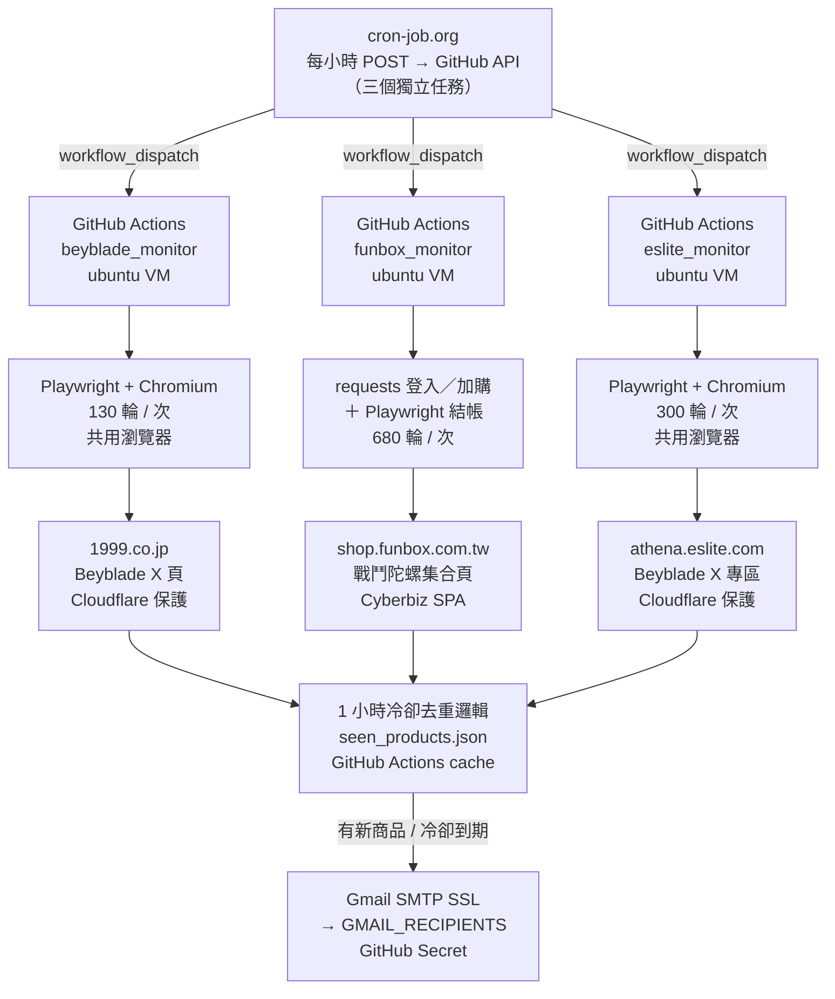

# 1999 X & Funbox & 誠品 商品偵測器

自動偵測三個電商的 Beyblade X 商品庫存，Funbox 偵測到有庫存時同時自動登入下單，並透過 Gmail 發送通知。每小時由 cron-job.org 觸發一次 GitHub Actions，每次執行持續監控約 60 分鐘。

---

## 架構圖



---

## 專案結構

```
beyblade-funbox-monitor/
├── .github/
│   └── workflows/
│       ├── beyblade_monitor.yml   # 1999.co.jp Beyblade X workflow
│       ├── funbox_monitor.yml     # Funbox 戰鬥陀螺 workflow
│       └── eslite_monitor.yml     # 誠品 Beyblade X workflow
├── beyblade_monitor/
│   ├── beyblade_monitor.py        # 主程式（Playwright，含 Cloudflare 反偵測）
│   └── requirements.txt
├── funbox_monitor/
│   ├── funbox_monitor.py          # 主程式（requests + Playwright 混合架構）
│   └── requirements.txt
└── eslite_monitor/
    ├── eslite_monitor.py          # 主程式（Playwright 繞過 Cloudflare，僅通知）
    └── requirements.txt
```

---

## 三個監控器比較

| | 1999 (Beyblade) | Funbox | 誠品 (Eslite) |
|---|---|---|---|
| 目標網站 | `1999.co.jp` | `shop.funbox.com.tw` | `eslite.com` |
| 偵測商品 | Beyblade X 系列 | 戰鬥陀螺 | Beyblade X 專區 |
| 反爬蟲 | Cloudflare（需反偵測） | Cyberbiz `/products.json` API | Cloudflare（Playwright 繞過） |
| 技術架構 | Playwright 全程（async） | requests 登入/加購 + Playwright 結帳 | Playwright 全程（sync，共用瀏覽器） |
| 每次執行輪數 | 130 輪（間隔 5~8 秒） | 680 輪（間隔 3~5 秒） | 300 輪（間隔 3~5 秒） |
| 執行時長 / timeout | 約 60 分鐘 / 62 min | 約 57 分鐘 / 65 min | 約 45 分鐘 / 62 min |
| 自動下單 | 無 | 有（3 帳號平行） | 無 |
| 觸發頻率 | 每小時一次 | 每小時一次 | 每小時一次 |

---

## Funbox 監控器功能

### 偵測邏輯

使用 Cyberbiz `/products.json` API，每輪不到 1 秒即可完成，解析以下欄位：

| 欄位 | 說明 |
|---|---|
| `inventory_quantity` | 實際庫存數量 |
| `inventory_quantity_status` | 庫存狀態（safety / low 等） |
| `inventory_policy` | `deny` = 售完即止，不超賣 |
| `qc` | 每筆訂單加購上限（`null` = 無限制） |
| `purchase_eligibility.status` | 購買資格（eligible / ineligible） |

每次偵測 log 輸出格式：
```
有庫存 → BX-01 雷霆飛龍 | 庫存:5 件 | 限購:1件/單 | NT$350
```

### 自動下單流程

```
偵測到有庫存商品
  │
  ├─ APP 限定商品 → 跳過（僅通知）
  │
  └─ 非 APP 商品 → 多帳號平行執行（ThreadPoolExecutor）
        │
        ├─ [帳號 1] requests 登入 → 加購所有商品（各 3 件）→ 取得 /carts/{token}
        ├─ [帳號 2] 同步並行執行
        └─ [帳號 3] 同步並行執行
              │
              └─ Playwright 開啟結帳 SPA
                    ├─ 確認結帳頁為 /carts/{token}（session 驗證）
                    ├─ 選擇 7-11 貨到付款（避免信用卡 3DS 卡單）
                    ├─ 套用優惠券（若有可用）
                    ├─ 勾選同意條款
                    └─ 點擊立即結帳
```

### 購買數量規則

- 預設每件商品加入 **3 件**（`CART_QTY=3`）
- 若商品有限購（`qc` 欄位有值）：`min(3, 庫存, qc)`
- 若庫存不足 3 件：`min(3, 庫存)`
- 某件商品加購失敗 → 跳過該件，繼續加其他商品，最後一起結帳

### 結帳狀態判斷

| 狀態 | 說明 |
|---|---|
| `success` | ✅ 已自動結帳完成 |
| `payment_failed` | ❌ 訂單已建立但付款失敗（`?show_failed=yes`），請手動完成付款 |
| `3ds_pending` | ⚠ 訂單已建立，需完成銀行 3DS 驗證 |
| `cart` | 🛒 商品已在購物車，請手動完成結帳 |
| `failed` | ❌ 自動購買失敗，請手動下單 |

### 通知冷卻邏輯

```
每輪執行
  │
  ├─ 取得 API 有庫存商品清單
  │
  ├─ 先清除 seen_products 中「已不在庫存」的條目
  │     └─ 確保商品下架後再上架，能立即重新通知並下單
  │
  ├─ 比對剩餘 seen_products
  │     ├─ 未曾通知 → 發通知 + 下單
  │     ├─ 上次通知超過 1 小時 → 再次發通知 + 下單
  │     └─ 1 小時內已通知 → 跳過（冷卻中）
  │
  └─ 更新 seen_products（台灣時間時間戳）
```

> **重點**：庫存歸零時，當輪即從 `seen_products` 移除；商品重新上架時視為全新，不受 1 小時限制。

### Email 通知格式

- 主旨：`【Funbox 有貨了！】偵測到 N 件商品`
- 每件商品顯示：商品名、價格、庫存、下單上限、連結
- 各帳號購買狀態三態顯示：
  - `✅ 已加入購物車`
  - `❌ 加入失敗（受限或錯誤）`
  - `— 未嘗試（超出本次購買上限）`
- 各帳號結帳結果
- 偵測時間（台灣時間 UTC+8）

---

## 誠品監控器功能

### 偵測邏輯

使用 Playwright 開啟 `athena.eslite.com` book_exhibits API（繞過 Cloudflare），對 JSON 回應進行**遞迴解析**，找出所有含 `product_guid` + `name` 的節點（不限巢狀深度）。

解析欄位：

| 欄位 | 說明 |
|---|---|
| `stock` | 庫存數量 |
| `account_qty_limit` | 帳號購買上限（`null` = 無限制） |
| `order_qty_limit` | 每單購買上限（`null` = 無限制） |
| `status` / `product_button_status` | 商品狀態（`add_to_shopping_cart` 表示可購買） |

### 效能優化

單次執行僅啟動一次 Chromium，所有 300 輪共用同一個 page：

```
啟動 Chromium（僅一次）
  │
  ├─ 第 1 輪：page.goto(API) + 解析 + 通知（~9 秒）
  ├─ 第 2 輪：page.goto(API) + 解析（~7 秒，省去瀏覽器啟動）
  ├─ ...
  └─ 第 300 輪
  │
  └─ 關閉瀏覽器
```

| | 舊版（每輪重啟） | 新版（共用瀏覽器） |
|---|---|---|
| 每輪耗時 | ~15 秒 | ~7 秒（第 2 輪起） |
| 60 分鐘可跑 | ~180 輪 | ~300 輪 |

### 略過商品

名稱含 `ESLITE_SKIP_KEYWORDS`（預設 `UX-14`）的商品不通知，逗號分隔可設多組關鍵字。

### 冷卻邏輯

與 Funbox 完全一致：1 小時冷卻、庫存歸零即清除 `seen_products`。

### Email 通知格式

- 主旨：`【誠品 Beyblade X 有貨了！】偵測到 N 件商品`
- 每件商品顯示：商品名、庫存、帳號上限、每單上限、連結
- 偵測時間（台灣時間 UTC+8）
- 無自動下單（僅通知）

---

## 環境設定

### GitHub Secrets（必填）

| Secret | 說明 |
|---|---|
| `GMAIL_SENDER` | 寄件 Gmail 帳號 |
| `GMAIL_PASSWORD` | Gmail App Password（非登入密碼） |
| `GMAIL_RECIPIENTS` | 收件人，逗號分隔（三個監控共用） |
| `FUNBOX_EMAIL` | Funbox 帳號 1 |
| `FUNBOX_PASSWORD` | Funbox 密碼 1 |
| `FUNBOX_EMAIL_2` | Funbox 帳號 2 |
| `FUNBOX_PASSWORD_2` | Funbox 密碼 2 |
| `FUNBOX_EMAIL_3` | Funbox 帳號 3 |
| `FUNBOX_PASSWORD_3` | Funbox 密碼 3 |

> 設定路徑：GitHub Repo → Settings → Secrets and variables → Actions → New repository secret

### 本機開發

**`funbox_monitor/.env`**（不進版控）：

```env
GMAIL_SENDER=your@gmail.com
GMAIL_PASSWORD=xxxx xxxx xxxx xxxx
GMAIL_RECIPIENTS=a@gmail.com,b@gmail.com
CHECK_ROUNDS=1
FUNBOX_EMAIL=your_funbox@gmail.com
FUNBOX_PASSWORD=your_password
FUNBOX_EMAIL_2=second@gmail.com
FUNBOX_PASSWORD_2=second_password
FUNBOX_EMAIL_3=third@gmail.com
FUNBOX_PASSWORD_3=third_password
```

**`eslite_monitor/.env`**（不進版控）：

```env
GMAIL_SENDER=your@gmail.com
GMAIL_PASSWORD=xxxx xxxx xxxx xxxx
GMAIL_RECIPIENTS=a@gmail.com,b@gmail.com
CHECK_ROUNDS=1
STATE_FILE=seen_products.json
```

#### Funbox 選填環境變數

| 變數 | 預設值 | 說明 |
|---|---|---|
| `SEARCH_URL` | Beyblade 集合 URL | 監控目標（可改為任意 Cyberbiz 集合或單一商品 URL） |
| `CHECK_ROUNDS` | `1` | 執行輪數（GitHub Actions 設為 680） |
| `CART_QTY` | `3` | 每件商品加入購物車數量 |
| `MAX_BUY_PRODUCTS` | `0`（無限制） | 限制本次最多購買幾件（測試用） |
| `TEST_MODE` | `0` | 設為 `1` 時 email 主旨加【測試】標注 |

#### 誠品選填環境變數

| 變數 | 預設值 | 說明 |
|---|---|---|
| `ESLITE_API_URL` | CU202503-00091 專區 URL | 監控目標（可替換為其他誠品活動頁 API） |
| `ESLITE_SKIP_KEYWORDS` | `UX-14` | 略過的商品關鍵字，逗號分隔 |
| `CHECK_ROUNDS` | `1` | 執行輪數（GitHub Actions 設為 300） |

```bash
# Funbox
pip install -r funbox_monitor/requirements.txt
python -m playwright install chromium
cd funbox_monitor && python funbox_monitor.py

# 誠品
pip install -r eslite_monitor/requirements.txt
python -m playwright install chromium
cd eslite_monitor && python eslite_monitor.py
```

---

## 狀態持久化

`seen_products.json` 由 GitHub Actions cache 在跨執行之間傳遞（三個監控各自獨立）：

```yaml
# Funbox
- uses: actions/cache@v4
  with:
    path: funbox_monitor/seen_products.json
    key: funbox-seen-${{ github.run_id }}
    restore-keys: funbox-seen-

# 誠品
- uses: actions/cache@v4
  with:
    path: eslite_monitor/seen_products.json
    key: eslite-seen-${{ github.run_id }}
    restore-keys: eslite-seen-

# 1999 (Beyblade)
- uses: actions/cache@v4
  with:
    path: beyblade_monitor/seen_products.json
    key: beyblade-seen-${{ github.run_id }}
    restore-keys: beyblade-seen-
```

---

## 觸發方式

由 **cron-job.org** 每小時呼叫 GitHub API，三個監控各建一個獨立任務：

```
POST https://api.github.com/repos/k0341055/beyblade-funbox-monitor/actions/workflows/funbox_monitor.yml/dispatches
POST https://api.github.com/repos/k0341055/beyblade-funbox-monitor/actions/workflows/beyblade_monitor.yml/dispatches
POST https://api.github.com/repos/k0341055/beyblade-funbox-monitor/actions/workflows/eslite_monitor.yml/dispatches
```

每個任務的 Request Headers：
```
Authorization: Bearer <PAT>
Content-Type: application/json
Accept: application/vnd.github+json
```

Request Body：
```json
{"ref": "main"}
```

成功回應：**204 No Content**

> PAT 需要 **Actions: Read and write** 權限（Fine-grained token，僅選此 repo 即可）。
