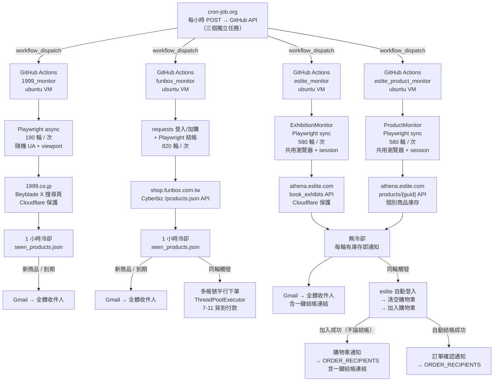

# 1999 X & Funbox & 誠品 商品偵測器

自動偵測三個電商的 Beyblade X 商品庫存，並在有庫存時透過 Gmail 發送通知。Funbox 與誠品支援自動下單。每小時由 cron-job.org 觸發一次 GitHub Actions，每次執行持續監控約 45~60 分鐘。

---

## 架構圖



---

## 專案結構

```
beyblade-funbox-monitor/
├── .github/
│   └── workflows/
│       ├── 1999_monitor.yml              # 1999.co.jp workflow
│       ├── funbox_monitor.yml            # Funbox 戰鬥陀螺 workflow
│       ├── eslite_monitor.yml            # 誠品書展監控 workflow（MONITOR_MODE=exhibition）
│       └── eslite_product_monitor.yml    # 誠品個別商品監控 workflow（MONITOR_MODE=product）
├── 1999_monitor/
│   ├── 1999_monitor.py             # 主程式（Playwright async，僅通知）
│   └── requirements.txt
├── funbox_monitor/
│   ├── funbox_monitor.py           # 主程式（requests + Playwright 混合）
│   └── requirements.txt
└── eslite_monitor/
    ├── eslite_monitor.py           # 主程式（OOP，MONITOR_MODE 切換兩種監控）
    ├── generate_session.py         # 一次性工具：本機手動登入並儲存 session
    └── requirements.txt
```

---

## 三個監控器比較

| | 1999 | Funbox | 誠品書展 | 誠品個別商品 |
|---|---|---|---|---|
| 目標網站 | `1999.co.jp` | `shop.funbox.com.tw` | `eslite.com` | `eslite.com` |
| 偵測商品 | Beyblade X 系列 | 戰鬥陀螺集合頁 | Beyblade X 書展 API | `ESLITE_EXTRA_PRODUCTS` GUID 清單 |
| 反爬蟲機制 | Cloudflare（隨機 UA/viewport/locale） | Cyberbiz `/products.json`（無反爬） | Cloudflare（Playwright 繞過） | Cloudflare（Playwright 繞過） |
| 技術架構 | Playwright async | requests 登入/加購 + Playwright 結帳 | `ExhibitionMonitor`（OOP，Playwright sync） | `ProductMonitor`（OOP，Playwright sync） |
| 每次執行輪數 | 190 輪（間隔 5~8 秒） | 820 輪（間隔 3~5 秒） | 580 輪（間隔 3~5 秒） | 580 輪（間隔 3~5 秒） |
| 執行時長 / timeout | ~20 分鐘 / 62 min | ~57 分鐘 / 65 min | ~58 分鐘 / 65 min | ~58 分鐘 / 65 min |
| 通知冷卻 | 1 小時冷卻 | 1 小時冷卻 | **無冷卻（每輪有庫存即通知）** | **無冷卻（每輪有庫存即通知）** |
| 自動下單 | 無（1999 結帳需 reCAPTCHA） | **有**（3 帳號平行，7-11 貨到付款） | **有**（加入購物車 + 自動結帳） | **有**（加入購物車 + 自動結帳） |
| 觸發頻率 | 每小時一次 | 每小時一次 | 每小時一次 | 每小時一次（獨立 cron-job） |

---

## 1999 監控器功能

### 偵測邏輯

使用 Playwright async 開啟搜尋頁（`sortid=7&soldout=0` 只顯示有庫存商品），解析以下欄位：

| 欄位 | CSS 選擇器 |
|---|---|
| 商品標題 | `div.c-card__title` |
| 發售日 | `div.c-card__maker` |
| 價格 | `div.c-card__price-element` |
| 折扣 | `div.c-card__price-tags-discount span` |
| 商品連結 | `a.c-card__info-links` |

搜尋結果為空時，程式自動區分兩種情況：
- **Cloudflare 攔截**：偵測到 `challenge-form` 等元素 → WARNING log，本輪跳過
- **目前無現貨**：搜尋結果正常但為空 → INFO log（正常情形，不報錯）

### Cloudflare 反偵測策略

- 隨機 User-Agent：OS 字串 × Chrome 版本（118~125）× WebKit build 隨機組合
- 隨機 Viewport：1366×768 ~ 1920×1080 五種選一
- locale `ja-JP`、timezone `Asia/Tokyo`（模擬日本用戶）
- 自訂 HTTP headers（`Accept-Language`, `Sec-Fetch-*`）
- `navigator.webdriver = undefined`（隱藏自動化特徵）
- slow_mo 隨機 jitter（±30%）

### 通知冷卻邏輯

- 同款商品 **1 小時內最多通知一次**（`seen_products.json` 記錄上次通知時間）
- 商品下架 → 當輪從 `seen_products` 移除 → 重新上架視為全新，立即通知

### Email 通知格式

- 主旨：`【1999 beyblade X 補貨！】偵測到 N 件商品`
- 每件商品顯示：商品名、發售日、價格（含折扣）、商品連結
- 末尾附上一鍵結帳連結（`https://www.1999.co.jp/order`）與完整搜尋頁連結
- 無自動下單（1999.co.jp 結帳需通過 reCAPTCHA，須人工完成）

---

## Funbox 監控器功能

### 偵測邏輯

使用 `requests` 直接呼叫 Cyberbiz `/products.json` API，每輪不到 1 秒即可完成：

| 欄位 | 說明 |
|---|---|
| `inventory_quantity` | 實際庫存數量 |
| `inventory_policy` | `deny` = 售完即止，不超賣 |
| `qc` | 每筆訂單加購上限（`null` = 無限制） |
| `purchase_eligibility.status` | 購買資格（eligible / ineligible） |

每次偵測 log 輸出格式：
```
有庫存 → BX-01 雷霆飛龍 | 庫存:5 件 | 限購:1件/單 | NT$350
```

### 通知冷卻邏輯

```
每輪執行
  │
  ├─ Cyberbiz API 取得有庫存商品清單
  │
  ├─ 清除 seen_products 中「已下架」的條目
  │     └─ 確保商品下架後再上架，能立即重新通知並下單
  │
  ├─ 比對剩餘 seen_products
  │     ├─ 未曾通知 → 下單 + 發通知
  │     ├─ 上次通知超過 1 小時 → 下單 + 再次通知
  │     └─ 1 小時內已通知 → 跳過（冷卻中）
  │
  └─ 更新 seen_products（台灣時間時間戳）
```

> **重點**：庫存歸零時，當輪即從 `seen_products` 移除；商品重新上架視為全新，不受 1 小時限制。

### 自動下單流程

```
偵測到需通知的有庫存商品
  │
  ├─ APP 限定商品（標題含 "APP"）→ 跳過（僅通知）
  │
  └─ 非 APP 商品 → 多帳號平行執行（ThreadPoolExecutor）
        │
        ├─ [帳號 1] requests 登入 → 全部商品加入購物車 → Playwright 結帳
        ├─ [帳號 2] 同步並行執行
        └─ [帳號 3] 同步並行執行
              │
              └─ Playwright 結帳 SPA
                    ├─ 確認結帳頁為 /carts/{token}（session 驗證）
                    ├─ 選擇 7-11 貨到付款（避免信用卡 3DS 卡單）
                    ├─ 套用優惠券（若有可用，選第一張）
                    ├─ 紅利點數重設為 0（避免自動折抵影響訂單）
                    ├─ 勾選所有同意條款 checkbox
                    └─ 點擊立即結帳（精確定位 btn-lg，排除頂部 nav 隱藏連結）
```

### 購買數量規則

| 情況 | 數量決策 |
|---|---|
| API `qc` 欄位有值 | `min(CART_QTY=3, 庫存, qc)` |
| 標題含隨機強化組/抽抽包 | `min(3, 庫存)` |
| 一般陀螺（保守） | `min(1, 庫存)` |

> 加購失敗時自動降量至 1 重試；降量後仍失敗則跳過該件，繼續其他商品。

### 下單狀態去重

`seen_products.json` 同時記錄三個 key：

| Key | 說明 | 去重規則 |
|---|---|---|
| `notified` | 上次通知時間 | 1 小時冷卻 |
| `purchased` | `{href: [成功帳號清單]}` | 已購買的帳號跳過 |
| `attempts` | `{href: {帳號: 失敗次數}}` | 失敗 ≥ 2 次跳過 |

### 結帳狀態判斷

| 狀態 | 說明 |
|---|---|
| `success` | ✅ 已自動結帳完成 |
| `payment_failed` | ❌ 訂單已建立但付款失敗（`?show_failed=yes`），請手動完成付款 |
| `3ds_pending` | ⚠ 訂單已建立，需完成銀行 3DS 驗證 |
| `checkout_limited` | 🚫 CYBERBIZ 在結帳層級攔截限購，請手動調整數量 |
| `cart` | 🛒 商品已在購物車，請手動完成結帳 |
| `failed` | ❌ 自動購買失敗，請手動下單 |

### Email 通知格式

- **廣播信**（→ 全體 GMAIL_RECIPIENTS）：商品資訊 + 各帳號結帳摘要（含狀態、加入件數）
- **個人信**（→ 各 Funbox 帳號）：該帳號每件商品加購狀態（✅ 加入 / ❌ 失敗 / — APP略過）+ 結帳結果

---

## 誠品監控器功能

### OOP 架構

`eslite_monitor.py` 採用 OOP 繼承設計，由環境變數 `MONITOR_MODE` 決定執行哪個子類別：

```
EsliteMonitorBase (ABC)
  ├─ 共用：登入、購物車、結帳、Email 通知、session 持久化、下單去重
  │
  ├─ ExhibitionMonitor（MONITOR_MODE=exhibition，預設）
  │     └─ 呼叫 book_exhibits API → 遞迴解析書展 JSON → ~6 秒/輪 → 580 輪/次
  │
  └─ ProductMonitor（MONITOR_MODE=product）
        └─ 逐一呼叫 products/{guid} API → ~6 秒/輪 → 580 輪/次
```

兩個模式分別由獨立 GitHub Actions workflow 觸發，各使用獨立的 `ORDER_STATE_FILE`（避免下單狀態互相干擾）：

| Workflow | MONITOR_MODE | CHECK_ROUNDS | ORDER_STATE_FILE |
|---|---|---|---|
| `eslite_monitor.yml` | `exhibition` | 580 | `eslite_order_state.json` |
| `eslite_product_monitor.yml` | `product` | 580 | `eslite_product_order_state.json` |

兩個 workflow 共用同一個 `eslite_storage_state.json`（session），以 `eslite-session-` cache key 共享。

### 偵測邏輯

**ExhibitionMonitor（書展 API）**

使用 Playwright 開啟 `athena.eslite.com/api/v1/book_exhibits/{EXHIBITION_ID}`（繞過 Cloudflare），對 JSON 回應進行**遞迴解析**，不限巢狀深度找出所有含 `product_guid` + `name` 的節點。每輪只呼叫一次 API，約 6 秒。

**ProductMonitor（個別商品）**

對 `ESLITE_EXTRA_PRODUCTS` 列出的 GUID，逐一呼叫 `athena.eslite.com/api/v1/products/{guid}` 查詢庫存狀態。

解析欄位：

| 欄位 | 說明 |
|---|---|
| `stock` | 庫存數量 |
| `account_qty_limit` | 帳號購買上限（`null` = 無限制） |
| `order_qty_limit` | 每單購買上限（`null` = 無限制） |
| `product_button_status` | `add_to_shopping_cart` 表示可購買 |

略過名稱含 `ESLITE_SKIP_KEYWORDS`（預設 `UX-14`）的商品。

### 通知邏輯（無冷卻）

**每輪只要偵測到有庫存，就立即發送通知**，沒有 1 小時冷卻限制。通知信件附有一鍵結帳連結（`eslite.com/cart/step2`）。

### 效能優化

單次執行僅啟動一次 Chromium，全部輪次共用同一個 page：

| | 舊版（含個別追蹤，混用） | ExhibitionMonitor | ProductMonitor |
|---|---|---|---|
| 每輪耗時 | ~9.4 秒（實測） | ~6 秒 | ~6 秒 |
| 60 分鐘可跑 | ~380 輪 | ~580 輪 | ~580 輪 |

OOP 拆分後，展覽監控不再呼叫個別商品 API，每輪節省約 3 秒。

### 自動下單流程

```
偵測到有庫存商品
  │
  ├─ 過濾：移除 eslite_order_state.json 中已下單的商品
  ├─ 取前 CHECKOUT_MAX 件（預設 3，防止大型展覽大量下單）
  │
  ├─ ensure_logged_in()
  │     ├─ 帶 storage_state cookies → 導覽 /member → 確認登出按鈕存在
  │     └─ 若未登入 → _do_login()（填帳密 → 等待 reCAPTCHA → 存 session）
  │
  ├─ 清空購物車（逐一點擊刪除按鈕）
  │
  ├─ 對每件商品：add_to_cart(guid, qty)
  │     ├─ 計算數量：min(account_qty_limit, order_qty_limit, stock)
  │     ├─ 等待 SPA 渲染（wait_for_selector，非固定 timeout）
  │     └─ 若 qty > 1，先填數量輸入框再點按鈕
  │
  ├─ 【立即發送購物車通知】→ ORDER_RECIPIENTS（含一鍵結帳連結）
  │     （此時商品已在購物車，就算後續結帳失敗也可手動結帳）
  │
  └─ checkout()
        ├─ goto /cart → 點結帳 → 選「誠品門市取貨」
        ├─ scrollBy(0, 400)（讓城市/門市下拉選單進入視窗）
        ├─ 選城市（CHECKOUT_CITY）→ 選門市（CHECKOUT_STORE_CODE）
        ├─ 點「ATM轉帳」→ 點「確認結帳」
        ├─ wait_for_url "**/cart/step3**"
        │
        ├─ 成功 → 發訂單確認通知 → 寫入 eslite_order_state.json（永久去重）
        └─ 失敗 → log 警告（商品仍留購物車，購物車通知已發出）
```

> 誠品購物車**跨裝置、跨登入持久存在**，就算自動結帳失敗，商品仍留在購物車中，使用者可直接點購物車通知信中的連結手動完成結帳。

### 下單去重

`eslite_order_state.json` 記錄已成功下單的 `product_guid`，**永久不重複下單**（即使商品重新上架）。只有手動刪除此檔案才會重置。

### Email 通知格式

| 通知類型 | 收件人 | 觸發時機 | 附帶資訊 |
|---|---|---|---|
| **庫存通知** | 全體 GMAIL_RECIPIENTS | 每輪偵測到有庫存 | 商品名/庫存/上限/連結 + 一鍵結帳連結 |
| **購物車通知** | ORDER_RECIPIENTS | 加入購物車成功後立即發 | 商品名/加入數量/上限 + 一鍵結帳連結 |
| **訂單確認通知** | ORDER_RECIPIENTS | 自動結帳成功 | 訂單編號/付款方式/取貨門市/商品清單 |
| **登入失敗警告** | ORDER_RECIPIENTS | Session 失效且無法自動登入 | 手動重新登入步驟說明 |

### Session 持久化（跨 VM 關鍵）

```
每次 run 開始
  ├─ 優先：Actions cache 還原 eslite_storage_state.json
  │         (key: eslite-session-{run_id}，restore-keys: eslite-session-)
  └─ 備援：若 cache miss → 從 ESLITE_STORAGE_STATE_B64 secret base64 解碼

程式執行結束
  └─ ctx.storage_state() 儲存最新 cookies（包含信任裝置 cookie）

每次 run 結束後
  └─ Actions cache 自動儲存（供下次 run 使用）
```

Session 存活時間：信任裝置 cookie 約 30~90 天，但由於腳本每小時執行並刷新 cookies，**只要連續正常執行 session 就不會過期**。

**Session 失效處理**（手動）：

```bash
# 1. 本機執行（會開啟瀏覽器，手動完成 reCAPTCHA / 簡訊驗證）
cd eslite_monitor && python generate_session.py

# 2. 更新 GitHub Secret
gh secret set ESLITE_STORAGE_STATE_B64 \
  --body "$(base64 -i eslite_storage_state.json | tr -d '\n')" \
  --repo k0341055/beyblade-funbox-monitor
```

---

## 環境設定

### GitHub Secrets（必填）

| Secret | 適用監控 | 說明 |
|---|---|---|
| `GMAIL_SENDER` | 全部 | 寄件 Gmail 帳號 |
| `GMAIL_PASSWORD` | 全部 | Gmail App Password（非登入密碼） |
| `GMAIL_RECIPIENTS` | 全部 | 收件人，逗號分隔（所有商品通知） |
| `FUNBOX_EMAIL` | Funbox | Funbox 帳號 1 |
| `FUNBOX_PASSWORD` | Funbox | Funbox 密碼 1 |
| `FUNBOX_EMAIL_2` | Funbox | Funbox 帳號 2 |
| `FUNBOX_PASSWORD_2` | Funbox | Funbox 密碼 2 |
| `FUNBOX_EMAIL_3` | Funbox | Funbox 帳號 3 |
| `FUNBOX_PASSWORD_3` | Funbox | Funbox 密碼 3 |
| `ESLITE_ACCOUNT` | 誠品 | 誠品登入帳號（手機號） |
| `ESLITE_PASSWORD` | 誠品 | 誠品登入密碼 |
| `ORDER_RECIPIENT` | 誠品 | 下單/購物車通知收件人（逗號分隔） |
| `CHECKOUT_CITY` | 誠品 | 取貨城市（如 `新竹市`） |
| `CHECKOUT_STORE_CODE` | 誠品 | 門市代碼（如 `B060` 巨城） |
| `ESLITE_EXTRA_PRODUCTS` | 誠品個別商品 | 要追蹤的商品 GUID，逗號分隔（ProductMonitor 使用） |
| `ESLITE_STORAGE_STATE_B64` | 誠品 | Session 備援（base64 編碼的 storage_state.json） |

> 設定路徑：GitHub Repo → Settings → Secrets and variables → Actions → New repository secret

### 本機開發

**`1999_monitor/.env`**：

```env
GMAIL_SENDER=your@gmail.com
GMAIL_PASSWORD=xxxx xxxx xxxx xxxx
GMAIL_RECIPIENTS=your@gmail.com
CHECK_ROUNDS=1
HEADLESS=false
# SEARCH_URL=https://www.1999.co.jp/search?typ1_c=100&cat=&searchkey=tomica&sortid=7&soldout=0
```

**`funbox_monitor/.env`**：

```env
GMAIL_SENDER=your@gmail.com
GMAIL_PASSWORD=xxxx xxxx xxxx xxxx
GMAIL_RECIPIENTS=a@gmail.com,b@gmail.com
CHECK_ROUNDS=1
FUNBOX_EMAIL=your_funbox@gmail.com
FUNBOX_PASSWORD=your_password
FUNBOX_EMAIL_2=second@gmail.com
FUNBOX_PASSWORD_2=second_password
FUNBOX_EMAIL_3=third@gmail.com
FUNBOX_PASSWORD_3=third_password
```

**`eslite_monitor/.env`**：

```env
GMAIL_SENDER=your@gmail.com
GMAIL_PASSWORD=xxxx xxxx xxxx xxxx
GMAIL_RECIPIENTS=a@gmail.com,b@gmail.com
ESLITE_ACCOUNT=0900000000
ESLITE_PASSWORD=YourPassword
ORDER_RECIPIENT=your@gmail.com
CHECKOUT_CITY=新竹市
CHECKOUT_STORE_CODE=B060
CHECK_ROUNDS=1
HEADLESS=false
AUTO_CHECKOUT=true
```

### 選填環境變數

#### 1999

| 變數 | 預設值 | 說明 |
|---|---|---|
| `SEARCH_URL` | Beyblade X 搜尋頁 URL | 監控目標（可替換為任意 1999.co.jp 搜尋 URL） |
| `CHECK_ROUNDS` | `1` | 執行輪數（GitHub Actions 設為 190） |
| `HEADLESS` | `true` | 設為 `false` 可在本機看到瀏覽器視窗 |

#### Funbox

| 變數 | 預設值 | 說明 |
|---|---|---|
| `SEARCH_URL` | 戰鬥陀螺集合頁 URL | 監控目標（可改為任意 Cyberbiz 集合 URL） |
| `CHECK_ROUNDS` | `1` | 執行輪數（GitHub Actions 設為 820） |
| `CART_QTY` | `3` | 每件商品目標加入數量 |
| `MAX_BUY_PRODUCTS` | `0`（無限制） | 限制本次最多購買幾件（測試用） |
| `TEST_MODE` | `0` | 設為 `1` 時 email 主旨加【測試】標注 |

#### 誠品

| 變數 | 預設值 | 說明 |
|---|---|---|
| `MONITOR_MODE` | `exhibition` | `exhibition`（書展 API）或 `product`（個別商品 GUID） |
| `ESLITE_API_URL` | CU202503-00091 展覽 API | ExhibitionMonitor 監控目標（可替換為其他誠品活動頁 API） |
| `ESLITE_EXTRA_PRODUCTS` | `10022136782683190211005` | ProductMonitor 追蹤的商品 GUID，逗號分隔 |
| `ESLITE_SKIP_KEYWORDS` | `UX-14` | 略過的商品名稱關鍵字，逗號分隔 |
| `CHECK_ROUNDS` | `1` | 執行輪數（書展與個別商品皆為 580） |
| `CHECKOUT_MAX` | `3` | 每次最多加入購物車的商品件數 |
| `AUTO_CHECKOUT` | `true` | 設為 `false` 可停用自動下單（僅通知） |
| `HEADLESS` | `true` | 設為 `false` 可在本機手動完成 reCAPTCHA |
| `ORDER_STATE_FILE` | `eslite_order_state.json` | 下單去重狀態檔路徑（兩個 workflow 使用不同檔名） |
| `STORAGE_STATE_FILE` | `eslite_storage_state.json` | Session cookies 存放路徑（兩個 workflow 共用） |

### 本機執行

```bash
# 1999
pip install -r 1999_monitor/requirements.txt
python -m playwright install chromium
cd 1999_monitor && python 1999_monitor.py

# Funbox
pip install -r funbox_monitor/requirements.txt
python -m playwright install chromium
cd funbox_monitor && python funbox_monitor.py

# 誠品（首次需先產生 session）
pip install -r eslite_monitor/requirements.txt
python -m playwright install chromium
cd eslite_monitor
python generate_session.py   # 開啟瀏覽器，手動完成登入/驗證，儲存 session
python eslite_monitor.py
```

---

## 狀態持久化

所有狀態檔由 GitHub Actions cache 在跨 run 之間傳遞，不進版控。

### 1999 / Funbox：通知冷卻狀態

```yaml
# 1999
- uses: actions/cache@v4
  with:
    path: 1999_monitor/seen_products.json
    key: 1999-seen-${{ github.run_id }}
    restore-keys: 1999-seen-

# Funbox（同時含 purchased / attempts 狀態）
- uses: actions/cache@v4
  with:
    path: funbox_monitor/seen_products.json
    key: funbox-seen-${{ github.run_id }}
    restore-keys: funbox-seen-
```

### 誠品：下單狀態 + Session

兩個 workflow 使用**不同 `ORDER_STATE_FILE`** 避免互相干擾，但共用同一個 session cache：

```yaml
# 書展下單去重（永久，key: eslite-order-）
- uses: actions/cache@v4
  with:
    path: eslite_monitor/eslite_order_state.json
    key: eslite-order-${{ github.run_id }}
    restore-keys: eslite-order-

# 個別商品下單去重（永久，key: eslite-product-order-）
- uses: actions/cache@v4
  with:
    path: eslite_monitor/eslite_product_order_state.json
    key: eslite-product-order-${{ github.run_id }}
    restore-keys: eslite-product-order-

# Session（兩個 workflow 共用，key: eslite-session-）
- uses: actions/cache@v4
  id: session-cache
  with:
    path: eslite_monitor/eslite_storage_state.json
    key: eslite-session-${{ github.run_id }}
    restore-keys: eslite-session-

- if: steps.session-cache.outputs.cache-hit != 'true'
  env:
    ESLITE_STORAGE_STATE_B64: ${{ secrets.ESLITE_STORAGE_STATE_B64 }}
  run: |
    if [ -n "$ESLITE_STORAGE_STATE_B64" ]; then
      echo "$ESLITE_STORAGE_STATE_B64" | base64 -d > eslite_monitor/eslite_storage_state.json
    fi
```

> Actions cache 最長保留 **7 天**，若超過 7 天沒有觸發，下次執行時 cache miss → 從 secret 還原 session。

---

## 觸發方式

由 **cron-job.org** 每小時呼叫 GitHub API，四個監控各建一個獨立任務：

```
POST https://api.github.com/repos/k0341055/beyblade-funbox-monitor/actions/workflows/1999_monitor.yml/dispatches
POST https://api.github.com/repos/k0341055/beyblade-funbox-monitor/actions/workflows/funbox_monitor.yml/dispatches
POST https://api.github.com/repos/k0341055/beyblade-funbox-monitor/actions/workflows/eslite_monitor.yml/dispatches
POST https://api.github.com/repos/k0341055/beyblade-funbox-monitor/actions/workflows/eslite_product_monitor.yml/dispatches
```

Request Headers：
```
Authorization: Bearer <PAT>
Content-Type: application/json
Accept: application/vnd.github+json
```

Request Body：
```json
{"ref": "main"}
```

成功回應：**204 No Content**

> PAT 需要 **Actions: Read and write** 權限（Fine-grained token，僅選此 repo 即可）。
