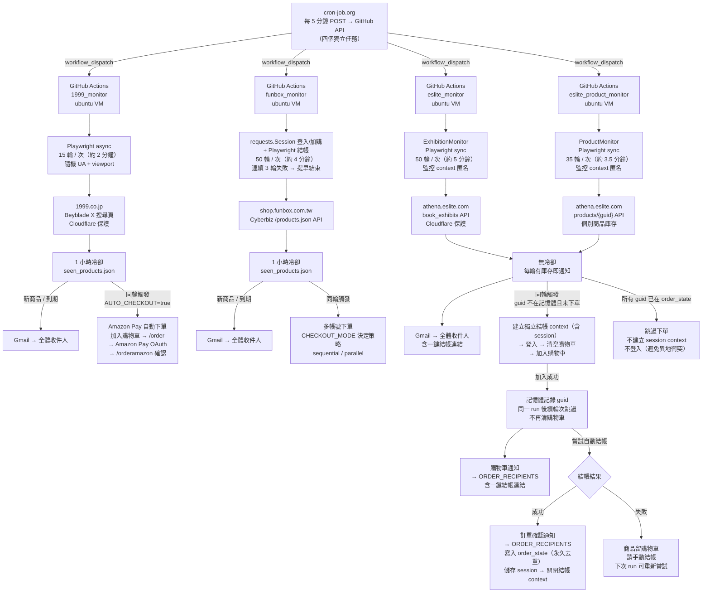

# 1999 X & Funbox & 誠品 商品偵測器

自動偵測三個電商的 Beyblade X 商品庫存，並在有庫存時透過 Gmail 發送通知。Funbox 與誠品支援自動下單。由 cron-job.org 每 5 分鐘觸發一次 GitHub Actions，每次啟動全新 VM 執行約 5 分鐘的監控，確保任何 runner 網路異常最多影響一個 5 分鐘窗口。

### 術語定義

| 術語 | 說明 |
|---|---|
| **Run（執行）** | cron-job.org 每 5 分鐘觸發一次 GitHub Actions，啟動一個全新 ubuntu VM，執行整個監控程式直到結束。每次 run 約 5 分鐘，結束後 VM 銷毀，所有記憶體狀態清空。若 Funbox 連續 3 輪連線失敗，程式會提早結束 run（放棄問題 runner），交由下次排程取得新 VM。 |
| **Round（輪）** | Run 內的一次偵測循環：呼叫 API → 解析庫存 → 通知／下單。每輪約 6 秒，一個 run 包含約 50 輪。 |

---

## 架構圖



---

## 專案結構

```
beyblade-funbox-monitor/
├── .github/
│   └── workflows/
│       ├── 1999_monitor.yml              # 1999.co.jp workflow
│       ├── funbox_monitor.yml            # Funbox 戰鬥陀螺 workflow
│       ├── eslite_monitor.yml            # 誠品書展監控 workflow（MONITOR_MODE=exhibition）
│       └── eslite_product_monitor.yml    # 誠品個別商品監控 workflow（MONITOR_MODE=product）
├── 1999_monitor/
│   ├── 1999_monitor.py             # 主程式（Playwright async，僅通知）
│   └── requirements.txt
├── funbox_monitor/
│   ├── funbox_monitor.py           # 主程式（requests + Playwright 混合）
│   └── requirements.txt
└── eslite_monitor/
    ├── eslite_monitor.py           # 主程式（OOP，MONITOR_MODE 切換兩種監控）
    ├── generate_session.py         # 一次性工具：本機手動登入並儲存 session
    └── requirements.txt
```

---

## 三個監控器比較

| | 1999 | Funbox | 誠品書展 | 誠品個別商品 |
|---|---|---|---|---|
| 目標網站 | `1999.co.jp` | `shop.funbox.com.tw` | `eslite.com` | `eslite.com` |
| 偵測商品 | Beyblade X 系列 | 戰鬥陀螺集合頁 | Beyblade X 書展 API | `ESLITE_EXTRA_PRODUCTS` GUID 清單 |
| 反爬蟲機制 | Cloudflare（隨機 UA/viewport/locale） | Cyberbiz `/products.json`（無反爬） | Cloudflare（Playwright 繞過） | Cloudflare（Playwright 繞過） |
| 技術架構 | Playwright async | requests 登入/加購 + Playwright 結帳 | `ExhibitionMonitor`（OOP，Playwright sync） | `ProductMonitor`（OOP，Playwright sync） |
| 每次執行輪數 | **15 輪**（間隔 5~8 秒） | **60 輪**（間隔 3~5 秒） | **50 輪**（間隔 3~5 秒） | **35 輪**（間隔 3~5 秒） |
| 執行時長 / timeout | ~2 分鐘 / 25 min | ~5 分鐘 / 25 min | ~5 分鐘 / 25 min | ~3.5 分鐘 / 25 min |
| 通知冷卻 | 1 小時冷卻 | 1 小時冷卻 | **無冷卻（每輪有庫存即通知）** | **無冷卻（每輪有庫存即通知）** |
| 自動下單 | **有**（Amazon Pay，需預存 session） | **有**（3 帳號平行，7-11取貨先付款） | **有**（加入購物車 + 自動結帳） | **有**（加入購物車 + 自動結帳） |
| 觸發頻率 | **每 5 分鐘一次** | **每 5 分鐘一次** | **每 5 分鐘一次** | **每 5 分鐘一次**（獨立 cron-job） |

---

## 1999 監控器功能

### 偵測邏輯

使用 Playwright async 開啟搜尋頁（`sortid=7&soldout=0` 只顯示有庫存商品），解析以下欄位：

| 欄位 | CSS 選擇器 |
|---|---|
| 商品標題 | `div.c-card__title` |
| 發售日 | `div.c-card__maker` |
| 價格 | `div.c-card__price-element` |
| 折扣 | `div.c-card__price-tags-discount span` |
| 商品連結 | `a.c-card__info-links` |

搜尋結果為空時，程式自動區分兩種情況：
- **Cloudflare 攔截**：偵測到 `challenge-form` 等元素 → WARNING log，本輪跳過
- **目前無現貨**：搜尋結果正常但為空 → INFO log（正常情形，不報錯）

### Cloudflare 反偵測策略

- 隨機 User-Agent：OS 字串 × Chrome 版本（118~125）× WebKit build 隨機組合
- 隨機 Viewport：1366×768 ~ 1920×1080 五種選一
- locale `ja-JP`、timezone `Asia/Tokyo`（模擬日本用戶）
- 自訂 HTTP headers（`Accept-Language`, `Sec-Fetch-*`）
- `navigator.webdriver = undefined`（隱藏自動化特徵）
- slow_mo 隨機 jitter（±30%）

### 通知冷卻邏輯

- 同款商品 **1 小時內最多通知一次**（`seen_products.json` 記錄上次通知時間）
- 商品下架 → 當輪從 `seen_products` 移除 → 重新上架視為全新，立即通知

### 自動下單流程（Amazon Pay）

```
偵測到需通知的有庫存商品（AUTO_CHECKOUT=true）
  │
  └─ Playwright（含預存 Amazon session）
        ├─ 商品頁 → 點擊「カートに入れる」（多 selector 備援）
        ├─ GET /order → 點擊 Amazon Pay 按鈕
        ├─ 等待跳轉至 amazon.co.jp
        │     ├─ 已登入 → 偵測「続行」按鈕並點擊
        │     └─ 未登入 → 填入 AMAZON_ACCOUNT / AMAZON_PASSWORD 完成登入
        ├─ 302 跳回 /orderamazon?amazonCheckoutSessionId=...
        ├─ 點擊「我同意並下單。」（#btnSendRight）
        └─ 偵測「採購訂單（已完成）」→ success
```

| 結帳狀態 | 說明 |
|---|---|
| `success` | ✅ 已自動下單完成 |
| `amazon_auth_needed` | ⚠ Amazon Pay 授權失敗（OTP 驗證、帳密錯誤，或需重新執行 `generate_1999_session.py`） |
| `cart_not_found` | ❌ 找不到加入購物車按鈕（可能已售完） |
| `no_amazon_pay` | ❌ 找不到 Amazon Pay 按鈕 |
| `login_failed` | ❌ 1999 帳號登入失敗 |
| `failed` | ❌ 未知錯誤 |

#### Amazon Pay Session 設定步驟（首次或 session 過期後需要 OTP 的情況）

```bash
# 1. 在本機執行
python 1999_monitor/generate_1999_session.py
# 在開啟的瀏覽器中：登入 1999.co.jp → 加入購物車 → 點 Amazon Pay → 完成授權
# 等待跳回 /orderamazon（不要按下單）

# 2. 上傳至 GitHub Secret
base64 -i 1999_monitor/1999_storage_state.json | pbcopy
# GitHub Repo → Settings → Secrets → AMAZON_1999_STORAGE_STATE_B64 → 貼上
```

需設定 GitHub Secrets：`ACCOUNT_1999`（1999 email）、`PASSWORD_1999`（1999 密碼）、`AMAZON_ACCOUNT`（Amazon Japan email）、`AMAZON_PASSWORD`（Amazon Japan 密碼）。

### Email 通知格式

- **廣播信**（→ 全體 GMAIL_RECIPIENTS）：商品資訊 + 結帳連結，不含下單結果
- **個人信**（→ ACCOUNT_1999 本人）：各商品下單狀態（✅/⚠/❌）+ 後續操作說明；僅在 `AUTO_CHECKOUT=true` 且有嘗試下單時發送

---

## Funbox 監控器功能

### 偵測邏輯

使用全域 `requests.Session` 呼叫 Cyberbiz `/products.json` API，重用 TCP/TLS connection，每輪不到 1 秒即可完成：

| 欄位 | 說明 |
|---|---|
| `inventory_quantity` | 實際庫存數量 |
| `inventory_policy` | `deny` = 售完即止，不超賣 |
| `qc` | 每筆訂單加購上限（`null` = 無限制） |
| `purchase_eligibility.status` | 購買資格（eligible / ineligible） |

每次偵測 log 輸出格式：
```
有庫存 → BX-01 雷霆飛龍 | 庫存:5 件 | 限購:1件/單 | NT$350
```

### 通知冷卻邏輯

```
每輪執行
  │
  ├─ Cyberbiz API 取得有庫存商品清單
  │
  ├─ 清除 seen_products 中「已下架」的條目
  │     └─ 確保商品下架後再上架，能立即重新通知並下單
  │
  ├─ 比對剩餘 seen_products
  │     ├─ 未曾通知 → 下單 + 發通知
  │     ├─ 上次通知超過 1 小時 → 下單 + 再次通知
  │     └─ 1 小時內已通知 → 跳過（冷卻中）
  │
  └─ 更新 seen_products（台灣時間時間戳）
```

> **重點**：庫存歸零時，當輪即從 `seen_products` 移除；商品重新上架視為全新，不受 1 小時限制。

### 自動下單流程

```
偵測到有庫存商品
  │
  ├─ SKIP_KEYWORDS 商品（標題含 "app"/"APP"）→ 完全靜默（不通知、不下單）
  ├─ SKIP_BUY_KEYWORDS 商品（標題含 BX-33/BX-26/BXG-33/BXG-29/蜘蛛人/暴風天馬/銀牙烈虎/烈焰飛鳳）
  │     → 發通知，跳過自動下單
  │
  └─ 一般商品 → 依 CHECKOUT_MODE 決定策略（YML 參數控制）
        │
        ├─ [sequential 模式，預設] 帳號間平行，每帳號登入一次後逐件商品依序執行：
        │     ├─ 商品排序：PRIORITY_KEYWORDS 最優先 → 購買次數少的優先（自然輪替）
        │     ├─ POST /cart/clear.js（清空購物車）
        │     ├─ POST /cart/add（加入 1 件，抽抽包/隨機強化組加 3 件）
        │     └─ Playwright 開啟 /cart → 立即結帳
        │
        └─ [parallel 模式] 每個（帳號 × 商品）各自獨立 thread 登入後立即結帳
              ├─ 商品排序同 sequential（PRIORITY 優先 → 購買次數少優先）
              └─ 最大並發數：PARALLEL_CHECKOUT_LIMIT（預設 6，避免被限流）
              │
              └─ Playwright 結帳 SPA（兩個模式共用）
                    ├─ 確認結帳頁為 /carts/{token}（session 驗證）
                    ├─ 選擇 7-11取貨(先付款)
                    ├─ 勾選所有同意條款 checkbox
                    └─ 點擊立即結帳（精確定位 btn-lg，排除頂部 nav 隱藏連結）
```

### 購買數量規則

| 情況 | 數量 |
|---|---|
| 標題含「隨機強化組」或「抽抽包」 | 3 件 |
| 其他（一般陀螺） | 1 件 |

> 每件商品獨立清空購物車後再加購，避免批次加購時售完商品卡住整筆訂單。

### 商品排序與購買輪替

每輪下單前，程式依以下規則決定每個帳號的購買順序：

1. **PRIORITY_KEYWORDS**（程式碼設定）：符合關鍵字的商品永遠排最前面，不管已購幾次
2. **購買次數少優先**：`purchased[href][email]` 計數越低的商品越先買，確保每件商品都有機會被買到
3. **連續失敗 ≥ 10 次**：自動跳過該（帳號 × 商品）組合，成功後歸零重計

### 下單狀態去重

`seen_products.json` 同時記錄三個 key：

| Key | 格式 | 規則 |
|---|---|---|
| `notified` | `{href: ISO時間戳}` | 1 小時通知冷卻 |
| `purchased` | `{href: {帳號: 購買次數}}` | 不跳過，作為排序依據（次數少的優先） |
| `attempts` | `{href: {帳號: 連續失敗次數}}` | 連續失敗 ≥ 10 次才跳過；購買成功後歸零 |

> 舊版 `purchased` 格式（`{href: [帳號清單]}`）在讀取時自動遷移為新格式。

### 結帳狀態判斷

程式在結帳輪詢期間同時偵測 URL 跳轉與頁面文字，能識別以下六種結果：

| 狀態 | 說明 |
|---|---|
| `success` | ✅ 已自動結帳完成 |
| `payment_failed` | ❌ 訂單已建立但付款失敗（`?show_failed=yes`），請手動完成付款 |
| `3ds_pending` | ⚠ 訂單已建立，需完成銀行 3DS 驗證 |
| `checkout_limited` | 🚫 CYBERBIZ 在結帳層級攔截限購，請手動調整數量 |
| `stock_out` | ⚡ 結帳時商品已售完（加入購物車後被搶走，頁面文字偵測） |
| `cart` | 🛒 商品已在購物車，請手動完成結帳 |
| `failed` | ❌ 自動購買失敗，請手動下單 |

### API 連線穩定性

- **全域 `requests.Session`**：750 輪共用同一 TCP/TLS connection，避免每輪重建 handshake
- **指數退避重試**（最多 4 次）：connect timeout 8 秒；1st retry ~1s、2nd ~2s、3rd ~4s + jitter
- **429 / 5xx 暫時錯誤**：讀取 `Retry-After` header 等待後重試
- **連續失敗快速放棄**：若連續 3 輪 `fetch_products()` 全部失敗，程式提早 `break` 結束本次 run，交由下次排程取得新 runner（避免整個 run 困在網路有問題的 VM 上）

### Email 通知格式

- **廣播信**（→ 全體 GMAIL_RECIPIENTS）：商品資訊 + 各帳號逐件結帳狀態（帳號 × 商品 × 結帳結果）
- **個人信**（→ 各 Funbox 帳號）：該帳號每件商品結帳結果（✅ 成功 / ⚠ 3DS / ❌ 付款失敗 / — 略過）；有 `3ds_pending`/`payment_failed` 時附上訂單補繳連結

---

## 誠品監控器功能

### OOP 架構

`eslite_monitor.py` 採用 OOP 繼承設計，由環境變數 `MONITOR_MODE` 決定執行哪個子類別：

```
EsliteMonitorBase (ABC)
  ├─ 共用：登入、購物車、結帳、Email 通知、session 持久化、下單去重
  │
  ├─ ExhibitionMonitor（MONITOR_MODE=exhibition，預設）
  │     └─ 呼叫 book_exhibits API → 遞迴解析書展 JSON → ~6 秒/輪 → 50 輪/次
  │
  └─ ProductMonitor（MONITOR_MODE=product）
        └─ 逐一呼叫 products/{guid} API → ~6 秒/輪 → 35 輪/次
```

兩個模式分別由獨立 GitHub Actions workflow 觸發，各使用獨立的 `ORDER_STATE_FILE`（避免下單狀態互相干擾）：

| Workflow | MONITOR_MODE | CHECK_ROUNDS | ORDER_STATE_FILE |
|---|---|---|---|
| `eslite_monitor.yml` | `exhibition` | 50 | `eslite_order_state.json` |
| `eslite_product_monitor.yml` | `product` | 35 | `eslite_product_order_state.json` |

兩個 workflow 共用同一個 `eslite_storage_state.json`（session），以 `eslite-session-` cache key 共享。

### 偵測邏輯

**ExhibitionMonitor（書展 API）**

使用 Playwright 開啟 `athena.eslite.com/api/v1/book_exhibits/{EXHIBITION_ID}`（繞過 Cloudflare），對 JSON 回應進行**遞迴解析**，不限巢狀深度找出所有含 `product_guid` + `name` 的節點。每輪只呼叫一次 API，約 6 秒。

**ProductMonitor（個別商品）**

對 `ESLITE_EXTRA_PRODUCTS` 列出的 GUID，逐一呼叫 `athena.eslite.com/api/v1/products/{guid}` 查詢庫存狀態。

解析欄位：

| 欄位 | 說明 |
|---|---|
| `stock` | 庫存數量 |
| `account_qty_limit` | 帳號購買上限（`null` = 無限制） |
| `order_qty_limit` | 每單購買上限（`null` = 無限制） |
| `product_button_status` | `add_to_shopping_cart` 表示可購買 |

庫存判斷：`stock > 0`（書展 API）或 `product_button_status == "add_to_shopping_cart"`（個別商品 API）。部分陳列商品（如 UX-14）雖然出現在書展 API 中，但 `stock = 0`，會被庫存過濾自然排除，無需另設關鍵字黑名單。

### 通知邏輯（無冷卻）

**每輪只要偵測到有庫存，就立即發送通知**，沒有 1 小時冷卻限制。通知信件附有一鍵結帳連結（`eslite.com/cart/step2`）。

### 效能優化

單次執行僅啟動一次 Chromium，全部輪次共用同一個 page：

| | 舊版（含個別追蹤，混用） | ExhibitionMonitor | ProductMonitor |
|---|---|---|---|
| 每輪耗時 | ~9.4 秒（實測） | ~6 秒 | ~6 秒 |
| 60 分鐘可跑 | ~380 輪 | ~580 輪 | ~580 輪 |

OOP 拆分後，展覽監控不再呼叫個別商品 API，每輪節省約 3 秒。

### 自動下單流程

```
偵測到有庫存商品
  │
  ├─ 本次 run 內登入失敗已達 2 次 → 直接返回（僅繼續通知，不再嘗試登入）
  │     （run 結束後 VM 銷毀，下次 run 計數歸零）
  │
  ├─ 過濾：移除 eslite_order_state.json 中已下單的商品
  │         誠品每帳號每商品限購一次（不論哪次上架）
  ├─ 取前 CHECKOUT_MAX 件（預設 3，防止大型展覽大量下單）
  │
  ├─ 若所有商品均已下單 → 直接返回，不建立 session context，不登入
  │     （此後每輪仍繼續通知，但完全沒有登入行為，不影響使用者的 session）
  │
  ├─ 建立獨立結帳 context（載入 storage_state session cookies）
  │     與監控 context 完全隔離，避免從 GitHub runner（美國 IP）持續送認證請求
  │     導致帳號被誠品判定為異地登入並強制所有裝置登出
  │
  ├─ ensure_logged_in()
  │     ├─ 帶 storage_state cookies → 導覽 /member → 確認登出按鈕存在
  │     └─ 若未登入 → _do_login()（填帳密 → 等待 reCAPTCHA → 存 session）
  │           ├─ 登入成功 → 繼續下單
  │           └─ 登入失敗（簡訊驗證 / 帳密錯誤 / 例外）
  │                 ├─ 失敗計數 +1
  │                 ├─ 發送登入失敗警告 Email（說明手動重新登入步驟）
  │                 └─ 若失敗計數已達 2 → 後續輪次將跳過下單，僅繼續通知
  │
  ├─ 清空購物車（逐一點擊刪除按鈕）
  │
  ├─ 對每件商品：add_to_cart(guid, qty)
  │     ├─ 計算數量：min(account_qty_limit, order_qty_limit, stock)
  │     ├─ 等待 SPA 渲染（wait_for_selector，非固定 timeout）
  │     └─ 若 qty > 1，先填數量輸入框再點按鈕
  │
  ├─ 【記憶體記錄已加入的 guid（_cart_added_guids）】
  │     └─ 同一 run 內後續輪次偵測到此 guid → 跳過，不清購物車
  │         （下次 run 開始時記憶體重置，若誠品已自動清空購物車則可重新嘗試）
  │
  ├─ 【立即發送購物車通知】→ ORDER_RECIPIENTS（含一鍵結帳連結）
  │
  ├─ checkout()
  │     ├─ goto /cart → 點結帳 → 選「誠品門市取貨」
  │     ├─ scrollBy(0, 400)（讓城市/門市下拉選單進入視窗）
  │     ├─ 選城市（CHECKOUT_CITY）→ 選門市（CHECKOUT_STORE_CODE）
  │     ├─ 點「ATM轉帳」→ 點「確認結帳」
  │     ├─ wait_for_url "**/cart/step3**"
  │     │
  │     ├─ 成功 → 發訂單確認通知 → 寫入 order_state（永久去重）
  │     └─ 失敗 → log 警告（商品留購物車；下次 run 若庫存仍在可重新嘗試）
  │
  └─ 儲存最新 session cookies → 關閉結帳 context（session 只存在於本段期間）
```

> 誠品購物車**跨裝置、跨登入持久存在**，就算自動結帳失敗，商品仍留在購物車中，使用者可直接點購物車通知信中的連結手動完成結帳。

### 下單去重

`eslite_order_state.json` 只記錄**自動結帳成功**的商品 guid（永久去重）。

**誠品每帳號對同一商品限購一次，不論是哪次上架**。一旦商品寫入 `order_state`，後續所有輪次偵測到有庫存只會繼續通知，不會嘗試登入或下單。這也同時消除了 GitHub runner（美國 IP）與使用者（台灣）session 衝突的問題。

同一個 **run** 內，已加入購物車的 guid 記錄在記憶體（`_cart_added_guids`）：同一 run 後續的 **round** 遇到該 guid 會直接跳過，不清空購物車。Run 結束後 VM 銷毀，記憶體重置——下一個 run 若商品仍有庫存且尚未成功下單，程式會重新嘗試加入購物車。

> 若誠品因庫存歸零自動清空購物車，下一個 run 偵測到有新庫存即可重新加入，不受影響。
>
> 若想讓程式重新嘗試已成功下單的商品，刪除 `eslite_order_state.json` 中對應的條目即可。

### Email 通知格式

| 通知類型 | 收件人 | 觸發時機 | 附帶資訊 |
|---|---|---|---|
| **庫存通知** | 全體 GMAIL_RECIPIENTS | 每輪偵測到有庫存 | 商品名/庫存/上限/連結 + 一鍵結帳連結 |
| **購物車通知** | ORDER_RECIPIENTS | 加入購物車成功後立即發 | 商品名/加入數量/上限 + 一鍵結帳連結 |
| **訂單確認通知** | ORDER_RECIPIENTS | 自動結帳成功 | 訂單編號/付款方式/取貨門市/商品清單 |
| **登入失敗警告** | ORDER_RECIPIENTS | Session 失效且無法自動登入（每次 run 最多觸發 2 次，之後停止嘗試） | 手動重新登入步驟說明 |

### Session 持久化（跨 VM 關鍵）

```
每次 run（GitHub Actions 執行）開始
  ├─ 優先：Actions cache 還原 eslite_storage_state.json
  │         (key: eslite-session-{run_id}，restore-keys: eslite-session-)
  └─ 備援：若 cache miss → 從 ESLITE_STORAGE_STATE_B64 secret base64 解碼

監控期間（全部輪次）
  └─ 使用匿名 context（無 session cookies），API 請求不帶任何認證資訊

有庫存且需要下單時（_attempt_checkout 內）
  ├─ 建立獨立結帳 context，載入 storage_state
  ├─ 完成登入 / 下單流程
  └─ 成功或失敗後，儲存最新 session → 立即關閉結帳 context

每次 run 結束時
  └─ Actions cache 自動儲存（供下一個 run 使用）
```

Session 存活時間：信任裝置 cookie 約 30~90 天。由於監控輪次使用匿名 context，**session 只在實際下單時短暫出現**，大幅減少被誠品偵測為異地異常的機會。

**Session 失效處理**（手動）：

```bash
# 1. 本機執行（開啟 Chromium，手動輸入帳號密碼登入，含簡訊驗證碼，完成後自動儲存）
cd eslite_monitor && python generate_session.py

# 2. 更新 GitHub Secret
base64 -i eslite_monitor/eslite_storage_state.json | tr -d '\n' | \
  gh secret set ESLITE_STORAGE_STATE_B64
```

> `generate_session.py` 不需要 `.env` 帳密，直接開啟瀏覽器讓使用者手動登入，等待最多 5 分鐘（含簡訊驗證），登入成功後自動儲存 session。

---

## 環境設定

### GitHub Variables（必填）

API 目標 URL 存放於 Variables（内容可見，但不暴露在程式碼中）：

| Variable | 適用監控 | 說明 |
|---|---|---|
| `FUNBOX_SEARCH_URL` | Funbox | Funbox 戰鬥陀螺集合頁 URL |
| `SEARCH_URL_1999` | 1999 | 1999.co.jp Beyblade X 搜尋頁 URL |
| `ESLITE_API_URL` | 誠品書展 | 誠品書展 API URL（`athena.eslite.com/api/v1/book_exhibits/...`） |
| `ESLITE_EVENT_URL` | 誠品 | 誠品書展活動頁 URL（選填，附於通知信末尾） |
| `ESLITE_SEARCH_URL` | 誠品關鍵字 | Holmes 搜尋 API URL（`holmes.eslite.com/v1/search?...`，combined / keyword 模式必填） |

> 設定路徑：GitHub Repo → Settings → Secrets and variables → Actions → **Variables** 標籤 → New repository variable

### GitHub Secrets（必填）

| Secret | 適用監控 | 說明 |
|---|---|---|
| `GMAIL_SENDER` | 全部 | 寄件 Gmail 帳號 |
| `GMAIL_PASSWORD` | 全部 | Gmail App Password（非登入密碼） |
| `GMAIL_RECIPIENTS` | 全部 | 收件人，逗號分隔（所有商品通知） |
| `FUNBOX_EMAIL` | Funbox | Funbox 帳號 1 |
| `FUNBOX_PASSWORD` | Funbox | Funbox 密碼 1 |
| `FUNBOX_EMAIL_2` | Funbox | Funbox 帳號 2 |
| `FUNBOX_PASSWORD_2` | Funbox | Funbox 密碼 2 |
| `FUNBOX_EMAIL_3` | Funbox | Funbox 帳號 3 |
| `FUNBOX_PASSWORD_3` | Funbox | Funbox 密碼 3 |
| `ESLITE_ACCOUNT` | 誠品 | 誠品登入帳號（手機號） |
| `ESLITE_PASSWORD` | 誠品 | 誠品登入密碼 |
| `ORDER_RECIPIENT` | 誠品 | 下單/購物車通知收件人（逗號分隔） |
| `CHECKOUT_CITY` | 誠品 | 取貨城市（如 `XX市`） |
| `CHECKOUT_STORE_CODE` | 誠品 | 門市代碼（如 `B0XX` XX門市） |
| `ESLITE_EXTRA_PRODUCTS` | 誠品個別商品 | 要追蹤的商品 GUID，逗號分隔（ProductMonitor 使用） |
| `ACCOUNT_1999` | 1999 | 1999.co.jp 登入 email |
| `PASSWORD_1999` | 1999 | 1999.co.jp 登入密碼 |
| `AMAZON_ACCOUNT` | 1999 | Amazon Japan 登入 email（Amazon Pay 授權用） |
| `AMAZON_PASSWORD` | 1999 | Amazon Japan 登入密碼（Amazon Pay 授權用） |
| `AMAZON_1999_STORAGE_STATE_B64` | 1999 | Amazon Pay session 備援（base64 編碼），session 過期且需 OTP 時需更新 |
| `ESLITE_STORAGE_STATE_B64` | 誠品 | Session 備援（base64 編碼的 storage_state.json） |

> 設定路徑：GitHub Repo → Settings → Secrets and variables → Actions → **Secrets** 標籤 → New repository secret

### 本機開發

**`1999_monitor/.env`**：

```env
GMAIL_SENDER=your@gmail.com
GMAIL_PASSWORD=xxxx xxxx xxxx xxxx
GMAIL_RECIPIENTS=your@gmail.com
CHECK_ROUNDS=1
HEADLESS=false
SEARCH_URL={設定於 GitHub Variable SEARCH_URL_1999}
```

**`funbox_monitor/.env`**：

```env
GMAIL_SENDER=your@gmail.com
GMAIL_PASSWORD=xxxx xxxx xxxx xxxx
GMAIL_RECIPIENTS=a@gmail.com,b@gmail.com
CHECK_ROUNDS=1
FUNBOX_EMAIL=your_funbox@gmail.com
FUNBOX_PASSWORD=your_password
FUNBOX_EMAIL_2=second@gmail.com
FUNBOX_PASSWORD_2=second_password
FUNBOX_EMAIL_3=third@gmail.com
FUNBOX_PASSWORD_3=third_password
SEARCH_URL={設定於 GitHub Variable FUNBOX_SEARCH_URL}
```

**`eslite_monitor/.env`**：

```env
GMAIL_SENDER=your@gmail.com
GMAIL_PASSWORD=xxxx xxxx xxxx xxxx
GMAIL_RECIPIENTS=a@gmail.com,b@gmail.com
ESLITE_ACCOUNT=0900000000
ESLITE_PASSWORD=YourPassword
ORDER_RECIPIENT=your@gmail.com
CHECKOUT_CITY=XXCity
CHECKOUT_STORE_CODE=B0XX
CHECK_ROUNDS=1
HEADLESS=false
AUTO_CHECKOUT=true
ESLITE_API_URL={設定於 GitHub Variable ESLITE_API_URL}
ESLITE_EVENT_URL={設定於 GitHub Variable ESLITE_EVENT_URL}
```

### 選填環境變數

#### 1999

| 變數 | 來源 | 說明 |
|---|---|---|
| `SEARCH_URL` | GitHub Variable `SEARCH_URL_1999` | 監控目標（可替換為任意 1999.co.jp 搜尋 URL） |
| `CHECK_ROUNDS` | `1`（本機預設） | 執行輪數（GitHub Actions 設為 15） |
| `HEADLESS` | `true` | 設為 `false` 可在本機看到瀏覽器視窗 |

#### Funbox

| 變數 | 來源 | 說明 |
|---|---|---|
| `SEARCH_URL` | GitHub Variable `FUNBOX_SEARCH_URL` | 監控目標（可改為任意 Cyberbiz 集合 URL） |
| `CHECK_ROUNDS` | `1`（本機預設） | 執行輪數（GitHub Actions 設為 60） |
| `CHECKOUT_MODE` | YML input，預設 `sequential` | `sequential`：帳號平行、每帳號商品逐件；`parallel`：帳號×商品全平行 |
| `PARALLEL_CHECKOUT_LIMIT` | `6`（YML 硬寫） | parallel 模式最大並發 thread 數 |
| `PRIORITY_KEYWORDS` | 空（選填 env） | 逗號分隔關鍵字，符合商品永遠排最前面（不管購買次數） |
| `MAX_BUY_PRODUCTS` | `0`（無限制） | 限制本次最多購買幾件（0 = 不限，測試用） |
| `TEST_MODE` | `0` | 設為 `1` 時 email 主旨加【測試】標注 |

#### 誠品

| 變數 | 來源 | 說明 |
|---|---|---|
| `MONITOR_MODE` | `combined`（Actions 預設） | `combined`（書展+搜尋合併）、`keyword`（搜尋）、`exhibition`（書展 API）、`product`（個別商品） |
| `ESLITE_API_URL` | GitHub Variable `ESLITE_API_URL` | ExhibitionMonitor / combined 模式使用，書展下架可留空 |
| `ESLITE_SEARCH_URL` | GitHub Variable `ESLITE_SEARCH_URL` | Holmes 搜尋 API URL，keyword / combined 模式必填 |
| `ESLITE_EVENT_URL` | GitHub Variable `ESLITE_EVENT_URL` | 誠品書展活動頁 URL（選填，附於通知信末尾） |
| `ESLITE_EXTRA_PRODUCTS` | Secret `ESLITE_EXTRA_PRODUCTS` | ProductMonitor 追蹤的商品 GUID，逗號分隔 |
| `CHECK_ROUNDS` | `1`（本機預設） | 執行輪數（書展：50，個別商品：35） |
| `CHECKOUT_MAX` | `3` | 每次最多加入購物車的商品件數 |
| `AUTO_CHECKOUT` | `true` | 設為 `false` 可停用自動下單（僅通知） |
| `HEADLESS` | `true` | 設為 `false` 可在本機手動完成 reCAPTCHA |
| `ORDER_STATE_FILE` | `eslite_order_state.json` | 下單去重狀態檔路徑（兩個 workflow 使用不同檔名） |
| `STORAGE_STATE_FILE` | `eslite_storage_state.json` | Session cookies 存放路徑（兩個 workflow 共用） |

### 本機執行

```bash
# 1999
pip install -r 1999_monitor/requirements.txt
python -m playwright install chromium
cd 1999_monitor && python 1999_monitor.py

# Funbox
pip install -r funbox_monitor/requirements.txt
python -m playwright install chromium
cd funbox_monitor && python funbox_monitor.py

# 誠品（首次需先產生 session）
pip install -r eslite_monitor/requirements.txt
python -m playwright install chromium
cd eslite_monitor
python generate_session.py   # 開啟瀏覽器，手動完成登入/驗證，儲存 session
python eslite_monitor.py
```

---

## 狀態持久化

所有狀態檔由 GitHub Actions cache 在跨 run 之間傳遞，不進版控。

### 1999 / Funbox：通知冷卻狀態

```yaml
# 1999
- uses: actions/cache@v4
  with:
    path: 1999_monitor/seen_products.json
    key: 1999-seen-${{ github.run_id }}
    restore-keys: 1999-seen-

# Funbox（同時含 purchased / attempts 狀態）
- uses: actions/cache@v4
  with:
    path: funbox_monitor/seen_products.json
    key: funbox-seen-${{ github.run_id }}
    restore-keys: funbox-seen-
```

### 誠品：下單狀態 + Session

兩個 workflow 使用**不同 `ORDER_STATE_FILE`** 避免互相干擾，但共用同一個 session cache：

```yaml
# 書展下單去重（永久，key: eslite-order-）
- uses: actions/cache@v4
  with:
    path: eslite_monitor/eslite_order_state.json
    key: eslite-order-${{ github.run_id }}
    restore-keys: eslite-order-

# 個別商品下單去重（永久，key: eslite-product-order-）
- uses: actions/cache@v4
  with:
    path: eslite_monitor/eslite_product_order_state.json
    key: eslite-product-order-${{ github.run_id }}
    restore-keys: eslite-product-order-

# Session（兩個 workflow 共用，key: eslite-session-）
- uses: actions/cache@v4
  id: session-cache
  with:
    path: eslite_monitor/eslite_storage_state.json
    key: eslite-session-${{ github.run_id }}
    restore-keys: eslite-session-

- if: steps.session-cache.outputs.cache-hit != 'true'
  env:
    ESLITE_STORAGE_STATE_B64: ${{ secrets.ESLITE_STORAGE_STATE_B64 }}
  run: |
    if [ -n "$ESLITE_STORAGE_STATE_B64" ]; then
      echo "$ESLITE_STORAGE_STATE_B64" | base64 -d > eslite_monitor/eslite_storage_state.json
    fi
```

> Actions cache 最長保留 **7 天**，若超過 7 天沒有觸發，下次執行時 cache miss → 從 secret 還原 session。

---

## 觸發方式

由 **cron-job.org** 每 5 分鐘呼叫 GitHub API，四個監控各建一個獨立任務：

```
POST https://api.github.com/repos/k0341055/beyblade-funbox-monitor/actions/workflows/1999_monitor.yml/dispatches
POST https://api.github.com/repos/k0341055/beyblade-funbox-monitor/actions/workflows/funbox_monitor.yml/dispatches
POST https://api.github.com/repos/k0341055/beyblade-funbox-monitor/actions/workflows/eslite_monitor.yml/dispatches
POST https://api.github.com/repos/k0341055/beyblade-funbox-monitor/actions/workflows/eslite_product_monitor.yml/dispatches
```

Request Headers：
```
Authorization: Bearer <PAT>
Content-Type: application/json
Accept: application/vnd.github+json
```

Request Body：
```json
{"ref": "main"}
```

成功回應：**204 No Content**

> PAT 需要 **Actions: Read and write** 權限（Fine-grained token，僅選此 repo 即可）。

### 為什麼是每 5 分鐘而非每小時？

GitHub-hosted runner 每次啟動都是全新 VM，網路出口路徑不保證相同。將 Job 縮短至 5 分鐘的好處：

| | 每小時 1 次 × 60 分鐘 Job | 每 5 分鐘 1 次 × 5 分鐘 Job |
|---|---|---|
| runner 網路異常影響範圍 | 最多損失整整 1 小時 | 最多損失 5 分鐘 |
| 連線卡住時解法 | 等 Job 自己逾時 | 連續 3 輪失敗 → 提早結束，5 分鐘後新 runner |
| 故障自動恢復 | 下一小時 | 下一個 5 分鐘 |
